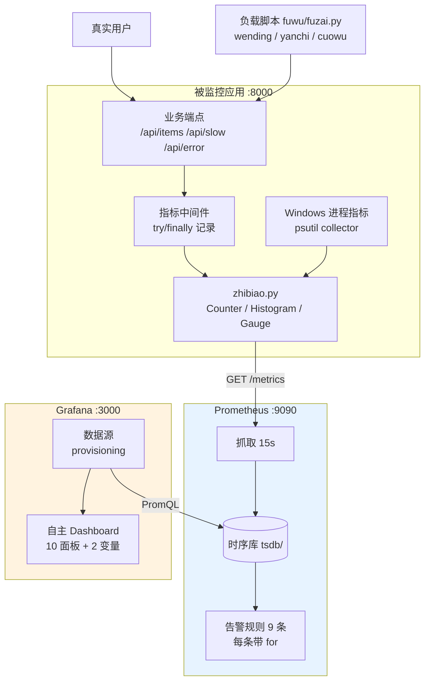

# observability-platform —— 软件运行监控与可观测性平台

《开源软件与新技术》实验08 成品。给一个 FastAPI 应用做**真实埋点**，
用 **Prometheus** 抓取并查询，在 **Grafana** 上搭一套**自己设计的** 10 面板 Dashboard，
再通过**受控的负载 / 延迟 / 错误 / 停机实验**验证指标能不能支撑诊断。

- 作者：王锐兵（软件2304，学号 23110506126）
- 被监控应用：<http://127.0.0.1:8000/metrics>
- Prometheus：<http://127.0.0.1:9090/targets>
- Grafana：<http://127.0.0.1:3000>
- 指标设计表：[metrics-design.md](metrics-design.md)

> 本仓库是二次开发成品，**不是** Prometheus / Grafana 的再分发。
> ⚠️ Grafana 是 **AGPL-3.0**，本仓库不分发它的任何代码或二进制。
> 详见 [NOTICE.md](NOTICE.md)。

---

## 一、目标用户与问题场景

**目标用户**：一个人维护几个小服务的开发者。

**问题场景**：服务"能启动"不等于"能稳定运行"。出问题时的典型困境是：

| 编号 | 困境 | 现在的答案 |
| --- | --- | --- |
| P1 | 用户说"刚才很慢"，什么时候慢的？ | 请求速率 + p50/p95 分位数面板 |
| P2 | 是所有人都慢，还是少数请求慢？ | p50 与 p95 一起看能区分 |
| P3 | 是量大了还是服务变差了？ | 在途请求数 + 请求速率交叉判断 |
| P4 | 有多少用户遇到了错误？ | 5xx 错误率（带分母保护） |
| P5 | 内存一直在涨，是泄漏吗？ | 进程 RSS 趋势（看斜率不看绝对值） |
| P6 | 监控自己会不会先挂？ | Prometheus 自监控 + 抓取耗时面板 |

**功能清单**：

| 功能 | 说明 |
| --- | --- |
| 应用埋点 | Counter / Histogram / Gauge 三类，7 个指标 |
| Windows 进程指标 | psutil 自建 collector（原生 Windows 上 client_python 不提供） |
| 高基数控制 | 模板路由做标签 + 分桶标签，4 条测试强制 |
| Prometheus 抓取 | 15s 间隔，2 个 job（应用 + Prometheus 自己） |
| 9 条告警规则 | 每条都写了**阈值依据**，全部带 `for` |
| **自主设计 Dashboard** | 10 个面板 + 2 个变量，每个面板都写清"回答什么问题" |
| Grafana provisioning | 数据源和 Dashboard 都用文件管理，可复现 |
| 受控实验脚本 | 三种负载模式 + 停机实验引导 |
| 66 条自动化测试 | 指标 / 配置 / PromQL / Dashboard / 异常五类 |

---

## 二、技术栈与架构

| 组件 | 版本 | 说明 |
| --- | --- | --- |
| 被监控应用 | FastAPI + Uvicorn | 见 `requirements.txt` |
| 指标暴露 | prometheus-client 0.26.0 | 真实安装并实跑 |
| 进程指标补充 | psutil 7.2.2 | 真实安装并实跑 |
| 指标抓取/存储/查询 | Prometheus 3.x | **未实跑**（见第六节） |
| 可视化 | Grafana OSS 13.x | **未实跑**，且是 AGPL-3.0 |

### 架构



### 三层职责

| 层 | 负责 | 不负责 |
| --- | --- | --- |
| 应用 | 暴露**原始累计指标**（Counter 只增、Histogram 记分布） | 不算速率、不算分位数 |
| Prometheus | 抓取、存储、用 PromQL 算 `rate()` 和分位数、评估告警 | 不负责画图 |
| Grafana | 查询 Prometheus、画图、阈值着色 | **不直接连应用** |

**为什么速率和分位数不由应用算**：
应用算的瞬时值没法回溯——服务重启就丢历史，而且"每秒多少"依赖采样窗口，
应用自己算等于把窗口选择权藏起来了。让 Prometheus 用 `rate()` 算，
窗口是查询时决定的，同一份数据可以用不同窗口看。

---

## 三、指标设计要点

完整设计表见 [metrics-design.md](metrics-design.md)。三个关键点：

### 3.1 用模板路由当标签（高基数控制）

```
✅ route="/api/items/{item_id}"    ← 取值数量 = 路由数量（8 个）
❌ route="/api/items/1"            ← 取值数量 = 商品数量（无限增长）
❌ route="/api/items?uid=123"      ← 用户 ID 进标签，最严重的高基数
```

代码里的强制点：

```python
def yuchuli_lu_you(request):
    route = request.scope.get("route")
    if route is None:
        return "unmatched"      # ★ 绝不回退到原始路径
    return getattr(route, "path", "unmatched")
```

实测证据（`scripts\ceshi.ps1` 第 ③ 步真实输出）：

```
http_requests_total{method="GET",route="/api/items",status="200"} 1.0
http_requests_total{method="GET",route="/api/items/{item_id}",status="200"} 2.0
```

访问了两个不同的商品 ID（1 和 2），但**只有一条序列**。

### 3.2 延迟必须用 Histogram

平均值会把长尾平均掉。99 个 10ms + 1 个 2000ms，平均只有 29.9ms，
看起来很好，但实际有 1% 的用户等了 2 秒。

桶边界：

```
(0.005, 0.01, 0.025, 0.05, 0.1, 0.25, 0.5, 1.0, 2.0, 5.0)
```

**1.0 这个边界一定要有**，因为告警阈值就是 1 秒。
桶边界没压在阈值上的话，"p95 > 1" 实际上是在 0.5 和 2.0 之间跳，告警会很迟钝。

### 3.3 Windows 进程指标要自己补

`prometheus_client` 的 `ProcessCollector` 是**面向 Linux 的**，
原生 Windows 上不提供 `process_cpu_seconds_total` 和
`process_resident_memory_bytes`。所以用 psutil 自建 collector，
并且**只在 win32 注册**（Linux 上已有的会冲突）。

实测输出：

```
process_cpu_seconds_total 1.3125
process_resident_memory_bytes 7.7766656e+07
```

---

## 四、安装、启动、停止

### 安装

```powershell
.\scripts\anzhuang.ps1
```

检查 Python 环境 → 装依赖（阿里云镜像）→ 找 Prometheus/Grafana
（找不到就给下载地址，**不自动下载**，两个包合计约 300MB）→ 跑测试。

### 启动

```powershell
.\scripts\qidong.ps1                        # 起应用 + Prometheus + Grafana
.\scripts\qidong.ps1 -BuQiPrometheus        # 只起应用（没有 Prometheus 时）
```

启动顺序：**先应用，再 Prometheus**。反过来的话第一次抓取会失败。
三个服务都用**健康检查轮询**确认就绪，不用固定 `sleep`。
`promtool check config` / `check rules` 在启动前跑，早发现配置错误。

### 停止

关掉脚本起的窗口，或按端口停：

```powershell
foreach ($dk in 8000,9090,3000) {
    Get-NetTCPConnection -LocalPort $dk -State Listen -ErrorAction SilentlyContinue |
        ForEach-Object { Stop-Process -Id $_.OwningProcess -Force -ErrorAction SilentlyContinue }
}
```

### 端口

| 服务 | 端口 | 说明 |
| --- | --- | --- |
| 被监控应用 | 8000 | `/metrics` 暴露指标 |
| Prometheus | 9090 | `/targets` `/rules` `/graph` |
| Grafana | 3000 | 首次登录 admin/admin，**要立刻改** |

---

## 五、Dashboard 与实验

### 自主设计的 Dashboard

`grafana/dashboards/ziyuan-yunxing.json`，**从零写的，没有导入社区面板**。

| # | 面板 | 回答的问题 |
| --- | --- | --- |
| ① | 服务是否在跑（up） | 抓得到吗？ |
| ② | 应用自报状态（app_up） | 应用自己觉得能服务吗？ |
| ③ | 5xx 错误率 | 多少用户遇到错误？（带分母保护） |
| ④ | 请求速率（按路由） | 多少流量、来自哪些接口？ |
| ⑤ | 延迟分位数 p50/p95/p99 + 平均值 | 慢不慢？有没有长尾？ |
| ⑥ | 状态码分布 | 错误是什么类型？ |
| ⑦ | 进程 CPU | 吃了多少 CPU？ |
| ⑧ | 进程内存 RSS | 有没有疑似泄漏？ |
| ⑨ | 在途请求数 | 有没有积压？ |
| ⑩ | 抓取耗时 | 抓取会不会失败？（预测） |

两个模板变量：`job`（抓取任务）、`route`（路由，多选）。
每个面板的 `description` 里都写清了它回答什么问题——
测试 `test_meige_mianban_dou_shuoming_ta_huida_de_wenti` 强制检查。

**面板阈值和告警阈值一致**：延迟面板 1s 变红，告警规则也是 1s。
不一致的话看的人会一脸问号（测试 `test_yuzhi_he_gaojing_guize_yizhi` 盯这个）。

### 异常实验

```powershell
.\scripts\fuzai.ps1 -Moshi wending -Cishu 300    # 只跑负载
.\scripts\yichang-shiyan.ps1                     # 四个实验连着跑
```

| 实验 | 做什么 | 看什么 |
| --- | --- | --- |
| A 负载变化 | 300 请求 / 并发 4 | 请求速率抬升、CPU 上升、在途数变化 |
| B 延迟注入 | 交替打 `/api/slow?delay_ms=200~650` | **p95 明显上抬而 p50 变化小** —— 长尾问题 |
| C 错误注入 | 一半请求打 `/api/error?rate=1` | 错误率突破 5%，`GaoCuowuLv` 告警 2 分钟后 Firing |
| D 停机（手动） | 手停应用 | `up` 变 0，`YingyongBukeYong` 从 Pending → Firing → Resolved |

**负载脚本的安全约束**：`jiancha_mubiao()` 写死了只允许回环地址，
传 `http://example.com` 或 `192.168.x.x` 会被拒绝。
有测试 `test_fuzai_jujue_feihuiluo_mubiao` 盯这个。

---

## 六、★ 已知限制（重要，如实记录）

### 6.1 Prometheus 和 Grafana **没有实跑**

| 项 | 状态 |
| --- | --- |
| 下载 Prometheus 3.x（约 100MB） | ❌ 未完成（本机实测约 100 KB/s，且 GitHub 下载被网络环境拦） |
| 下载 Grafana OSS（约 200MB） | ❌ 未下载 |
| 启动 Prometheus、看到 Targets UP | ❌ 未执行 |
| 在 Prometheus 里执行 PromQL | ❌ 未执行 |
| `promtool check config` / `check rules` | ❌ 未执行（promtool 在 Prometheus 包里） |
| 启动 Grafana、连接数据源 | ❌ 未执行 |
| 看到 Dashboard 曲线 | ❌ 未执行 |

**所以：没有任何"曲线符合预期"的断言。** 这一条在 README、
实验报告、测试记录里都写明了，没有把预期当成实测。

### 6.2 已经实跑并留证的

- **被监控应用真实运行**，`/metrics` 输出真实指标（原始文本见测试记录）
- **66 条测试全部通过**，其中包含对真实指标输出的断言
- 模板路由做标签、高基数控制、异常也计 5xx、在途数归零：
  **都是真实执行的代码路径**
- Windows 进程 CPU/内存指标：通过 psutil collector **真实输出**
  （`process_cpu_seconds_total 1.3125`、`process_resident_memory_bytes 7.78e7`）
- 负载脚本的目标校验：真实执行并拒绝非本机地址

### 6.3 其他限制

- 只有单实例、单 worker。多进程时 `prometheus_client` 的默认 Collector
  会各算各的（需要 `multiprocess` 模式，会引入额外复杂度），本实验没做。
- 没有接入日志和分布式追踪。指标只能回答"发生了什么"，
  回答"为什么"需要 trace / 日志关联，见 metrics-design.md 第六节的指标盲区表。
- 没有配 Altermanager 通知渠道（只做到 Firing 状态）。
- 报警阈值是按**本应用**的基线定的，换系统必须重新标定。

---

## 七、测试

```powershell
.\scripts\ceshi.ps1                                       # 全部
.\.venv\Scripts\python -m pytest tests -q -p no:warnings  # 只跑 pytest
```

**实测结果：66 passed in 4.95s**

| 测试类型 | 实验要求 | 本仓库 | 文件 |
| --- | --- | --- | --- |
| 指标单元/集成 | ≥6 | 14 | `tests/test_zhibiao.py` |
| 配置测试 | ≥3 | 9 | `tests/test_peizhi.py` |
| PromQL 测试 | ≥6 | 10 | `tests/test_promql.py` |
| Dashboard 测试 | ≥6 | 14 | `tests/test_dashboard.py` |
| 异常/恢复测试 | ≥3 | 13 | `tests/test_yichang.py` |

### 两个踩过的坑（都写进注释和报告了）

**坑 1：中间件在路由之前运行，`scope["route"]` 那时还是空的。**

第一版在 `call_next` **之前**取 `request.scope["route"]`，
结果所有请求的 `route` 标签都是 `unmatched`，模板路由完全失效。
测试 `test_qingqiu_jishu_zengjia` 报 `assert 0.0 == 1.0` 才暴露出来。

修法：把路由取值挪到 `call_next` **之后**（放在 `finally` 里）。

**坑 2：`TestClient` 默认把服务端异常抛回测试。**

默认 `raise_server_exceptions=True` 时，`/api/error` 抛的 RuntimeError
直接穿透到测试代码，我们根本拿不到 500 响应，
也就测不了"异常请求有没有被计入 5xx"。

修法：`TestClient(app, raise_server_exceptions=False)`。

### 关于 PromQL 测试的说明

本机没装 Prometheus，所以 `test_promql.py` 做的是**表达式静态校验**：
检查 `rate()` 有没有漏、`histogram_quantile` 有没有 `sum by (le)`、
窗口单位对不对、有没有高基数标签、错误率有没有分母保护。

这不能替代真的把查询发给 Prometheus 看返回值，但能抓到上面这些
**真实会犯的写法错误**。

---

## 八、目录结构

```
observability-platform/
├── README.md
├── LICENSE                      # MIT
├── NOTICE.md                    # ⚠️ 含 Grafana AGPL 义务说明
├── metrics-design.md            # ★ 指标设计表（问题→指标→单位→标签→桶）
├── requirements.txt
├── app/                         # 被监控应用
│   ├── zhibiao.py               #   指标定义 + 高基数控制工具
│   └── main.py                  #   埋点中间件 + 业务端点
├── prometheus/
│   ├── prometheus.yml           #   抓取配置
│   └── alert-rules.yml          #   ★ 9 条告警，每条带「阈值依据」
├── grafana/
│   ├── dashboards/ziyuan-yunxing.json   # ★ 自主设计的 10 面板 Dashboard
│   └── provisioning/            #   数据源与 Dashboard 的自动配置
├── fuwu/fuzai.py                # 受控负载脚本（拒绝非本机目标）
├── tests/                       # 66 条 pytest
├── scripts/                     # 安装/启动/负载/异常实验/测试
├── reports/                     # 异常实验时间线
└── docs/                        # 报告、Issue、测试记录
```

---

## 九、思考题

**1. 为什么请求延迟通常用 Histogram 而不是只记录平均值？**

平均值会把分布拍平，长尾被稀释掉。举个具体例子：
100 个请求里 99 个 10ms、1 个 2000ms，平均值是 29.9ms——
看起来完全正常。但实际有 1% 的用户等了 2 秒。

而且平均值**不可聚合**：可以`sum`两个服务的请求数，但不能直接平均
两个服务的平均延迟（除非知道各自的请求数）。Histogram 的桶是 Counter，
可以跨实例聚合后再算分位数。

另一个细节：分位数不能对"算好的分位数"再取平均。
`avg(p95_a, p95_b) ≠ p95(全部)`。必须用 `histogram_quantile` 从桶重新算。

**2. 标签基数过高会怎样影响内存、查询和系统可用性？**

Prometheus 为**每一组标签值组合**维护一条独立时间序列。
基数按标签取值数量的**乘积**增长：`|method| × |route| × |status|`。

本应用是 `7 × 8 × 20 ≈ 1120` 条，完全可控。
如果用了原始 URL，10 万个商品就是 `7 × 100000 × 20 = 1400 万条`。

后果链条：

1. **内存**：每条序列要维护索引和倒排表 → 内存爆。
2. **查询**：`sum(rate(...))` 要遍历匹配的序列 → 查询超时。
3. **抓取**：`/metrics` 文本变长 → 抓取变慢 → 可能超时 → `up=0`。
4. **可用性**：最坏情况 Prometheus OOM 被杀，监控整体失效——
   **监控系统的崩溃往往是自己造成的**。

**3. `rate()` 的窗口选择过短或过长会分别掩盖什么现象？**

| 窗口 | 会掩盖什么 | 会放大什么 |
| --- | --- | --- |
| 过短（如 15s，只有一个样本） | 真正的趋势；外推误差极大 | 采样抖动、瞬时尖峰 |
| 过长（如 30m） | 短时故障（被平均掉，看不到尖峰） | — |

本实验的做法是**按指标性质分别选**：

- 请求速率用 1m（纯计数，不受比例影响，能看出瞬时变化）
- 错误率、p95 用 5m（比例类，需要足够的分母才稳定）

测试 `test_shijian_chuangkou_buyao_guoduan` 强制所有窗口 ≥ 30s——
15s 抓取间隔下，30s 窗口只有 2 个样本，`rate()` 的外推不可靠。

**4. CPU 升高与 p95 延迟升高同时出现时，为什么仍不能直接断言 CPU 是根因？**

因为**相关性不等于因果**。三个具体的替代解释：

1. **共同原因**：某个下游变慢 → 请求排队 → 应用被迫等待但同时在自旋/重试
   → CPU 和延迟同时上升。这时 CPU 只是"陪着涨"。
2. **反向因果**：是延迟高了以后触发了更多重试/重算，才把 CPU 推上去。
3. **纯巧合**：两个独立事件在同一时间窗内发生（比如另一个进程在跑批）。

要确定因果，需要额外的证据：**变更记录**（那段时间部署了什么）、
**火焰图/堆栈采样**、**把 CPU 压下去的对照实验**。
指标能告诉你"发生了什么"，回答"为什么"需要更多信息源。

**5. 告警阈值应从固定经验值、历史基线还是 SLO 推导？不同选择适合什么场景？**

| 来源 | 适合场景 | 问题 |
| --- | --- | --- |
| **固定经验值**（如"p95 > 1s"） | 起步阶段、没有历史数据时 | 没有业务依据，容易定得过高或过低 |
| **历史基线**（如"比上周同期高 3 个标准差"） | 有稳定周期性流量的系统 | 业务增长会被误判为异常；大促期间必然误报 |
| **SLO 推导**（错误预算消耗速度） | 有明确可靠性目标的系统 | 需要先定义 SLI/SLO，前期成本高 |

本实验用的是**第三种思路的简化版**：不是拍一个数，而是拿
"正常演示时的基线"（错误率 0、p95 约 10ms）和
"受控实验能达到的水平"（错误率 50%、p95 约 1s）来卡区间，
取中间的 5% 和 1s。

**这个做法的合理之处**：阈值有可比对的上下界，不是凭空来的。
**局限**：一旦业务量或部署环境变化，必须重新标定。
真实系统应该走 SLO —— 先从"用户能接受多慢"反推错误预算，
再从预算消耗速度推阈值。
